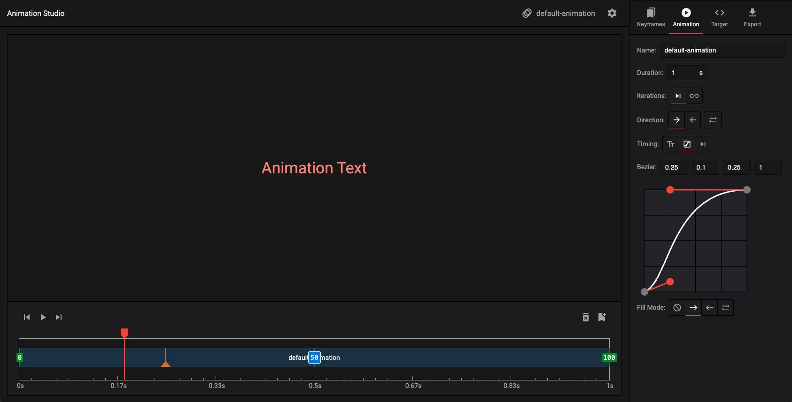
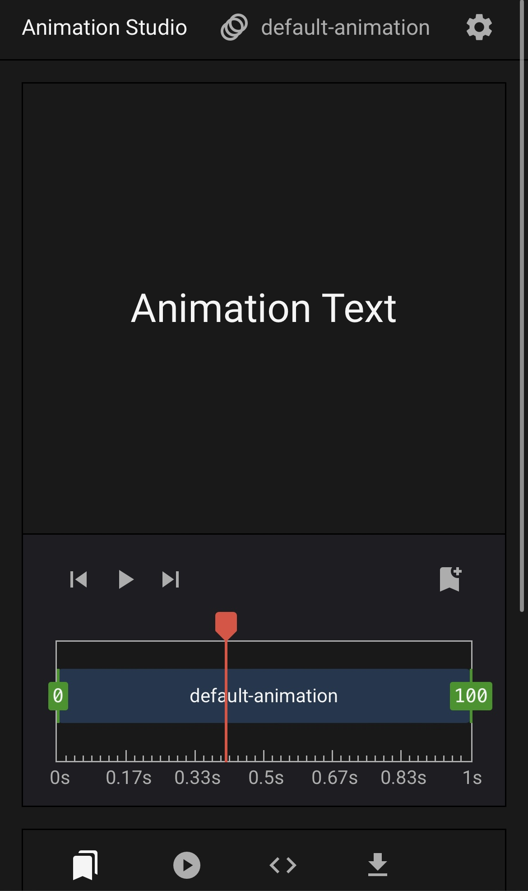

# Animation Studio

<p style="text-align: center;">
 &nbsp;&nbsp; 
</p>

Check out the [live demo](https://css-animation-studio.vercel.app/)!

Animation Studio was originally conceived as a library to store and quickly customize cool text animations. Eventually, scope creep led to the addition of modular keyframe editing, animation tuning, and html customization features, resulting in an entire editing studio for animations.

Since this is a project I built for fun in about a month, I don't intend to fully support it going forward, but I'll be looking to add animations and features here and there.

## TODOS

Next:

* Keyframe export code cleanup
* Get rid of keyframe blur editing
* Launch beta

Backlog:

* Add new animations to lib
* Clean up longform CSS string outputs
* Clean up preview logic
* Timeline:
  * Speed mods
* Mobile touch support -.-
* Saving + Projects
* Keyboard shortcuts
* Support linear() timing functions

## Getting Started

To run the dev server:

```bash
npm run dev
```

Before deploying:

```bash
npm test
npm run build
```